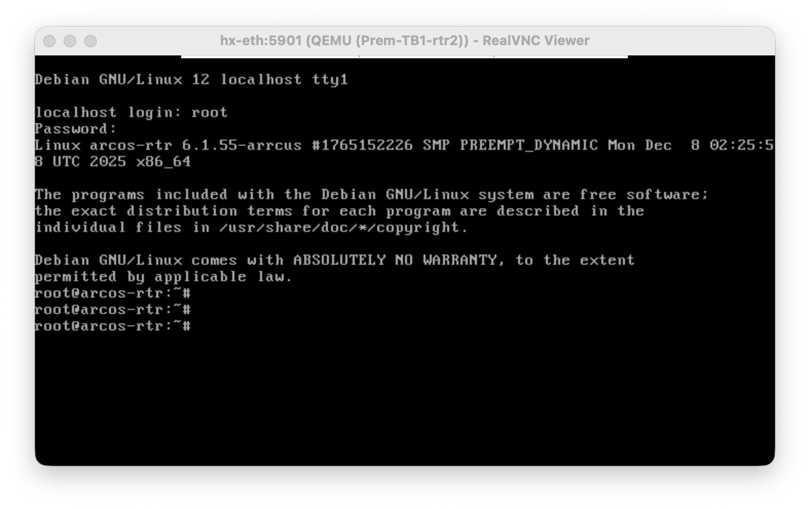

# ArcOS KVM Deployer

A streamlined toolkit for deploying ArcOS virtual machines on KVM/libvirt with Zero Touch Provisioning (ZTP) support.

---

## Table of Contents

- [Overview](#overview)
- [Features](#features)
- [Prerequisites](#prerequisites)
  - [System Requirements](#system-requirements)
  - [Sudo Access Setup](#sudo-access-setup)
- [Installation](#installation)
  - [Install Libvirt and virt-install](#install-libvirt-and-virt-install)
  - [Validate Installation](#validate-installation)
- [Environment Setup](#environment-setup)
  - [HTTP Server Configuration](#http-server-configuration)
  - [Libvirt Network Setup](#libvirt-network-setup)
  - [DHCP Server Configuration](#dhcp-server-configuration)
- [Usage](#usage)
  - [Script Options](#script-options)
  - [Launching VMs](#launching-vms)
  - [Accessing VMs](#accessing-vms)
  - [Cleanup](#cleanup)
- [Project Structure](#project-structure)
- [Sample Logs](#sample-logs)

---

## Overview

This project provides automation scripts to deploy ArcOS router images as KVM virtual machines on Debian-based systems. It handles:

- VM lifecycle management (create, run, destroy)
- Network configuration with bridge and NAT support
- Zero Touch Provisioning via DHCP options
- PCI passthrough for hardware interfaces

## Features

| Feature | Description |
|---------|-------------|
| **ZTP Support** | Automatic configuration via DHCP vendor options |
| **Flexible Networking** | Connect VMs via libvirt networks, bridges, or PCI passthrough |
| **Multi-VM Testbeds** | Organize VMs into testbeds for easy management |
| **Backing Store Disks** | Efficient disk usage with qcow2 backing files |
| **Serial Console** | Direct console access to VMs |
| **VNC Access** | Graphical console via VNC |

---

## Prerequisites

### System Requirements

- Debian-based Linux distribution
- Hardware virtualization support (Intel VT-x / AMD-V)
- At least 8GB RAM (16GB+ recommended for multiple VMs)
- QEMU/KVM compatible CPU

### Sudo Access Setup

**Install sudo:**

```bash
su -c "apt install sudo; usermod -aG sudo $USER"
```

**Enable passwordless sudo:**

```bash
echo "$USER ALL=(ALL) NOPASSWD: ALL" | sudo tee /etc/sudoers.d/${USER}
```

**Verify access:**

```bash
sudo echo Test
# Expected output: Test
```

---

## Installation

### Install Libvirt and virt-install

Install the required packages:

```bash
sudo apt install curl bridge-utils
sudo apt install --no-install-recommends qemu-system-x86 libvirt-clients libvirt-daemon-system \
                                         virtinst qemu-utils
```

Add your user to the libvirt group:

```bash
sudo usermod -aG libvirt $USER
```

> **Note:** Log out and back in for group changes to take effect.

### Validate Installation

Run the validation command:

```bash
sudo virt-host-validate qemu
```

Expected output (all should show PASS):

```
QEMU: Checking for hardware virtualization                                 : PASS
QEMU: Checking if device '/dev/kvm' exists                                 : PASS
QEMU: Checking if device '/dev/kvm' is accessible                          : PASS
QEMU: Checking if device '/dev/vhost-net' exists                           : PASS
QEMU: Checking if device '/dev/net/tun' exists                             : PASS
QEMU: Checking for cgroup 'cpu' controller support                         : PASS
QEMU: Checking for cgroup 'cpuacct' controller support                     : PASS
QEMU: Checking for cgroup 'cpuset' controller support                      : PASS
QEMU: Checking for cgroup 'memory' controller support                      : PASS
QEMU: Checking for cgroup 'devices' controller support                     : PASS
QEMU: Checking for cgroup 'blkio' controller support                       : PASS
QEMU: Checking for device assignment IOMMU support                         : PASS
QEMU: Checking if IOMMU is enabled by kernel                               : PASS
```

---

## Environment Setup

### HTTP Server Configuration

An HTTP server is required to serve the ZTP configuration files. This example uses `lighttpd`:

```bash
sudo apt install lighttpd
```

**Configure lighttpd** (`/etc/lighttpd/lighttpd.conf`):

```diff
        "mod_access",
        "mod_alias",
        "mod_redirect",
+       "mod_userdir",
 )

 server.document-root        = "/var/www/html"
 server.username             = "www-data"
 server.groupname            = "www-data"
 server.port                 = 80
+server.dir-listing          = "enable"
+alias.url                   = ( "/arrcus/" => "/space/prem/http/arrcus/" )
```

**Create directories and deploy config:**

```bash
# Create web directory
sudo mkdir -p /var/www/html/arrcus/
sudo chown www-data:www-data /var/www/html/arrcus/

# Create config directory and copy base config
sudo mkdir -p /space/prem/http/arrcus/ztp/
sudo cp sample_cfg/ztp/base.cfg /space/prem/http/arrcus/ztp/base.cfg

# Restart the server
sudo systemctl restart lighttpd
```

**Verify the configuration is accessible:**

```bash
curl -s http://127.0.0.1/arrcus/ztp/base.cfg | head -5
```

### Libvirt Network Setup

**Set the default URI** (add to `~/.bashrc` or `~/.zshrc`):

```bash
export LIBVIRT_DEFAULT_URI="qemu:///system"
```

**Verify user group membership:**

```bash
groups | grep -o libvirt
```

**Ensure the default network is active:**

```bash
virsh net-list --all
```

If the default network is not active:

```bash
virsh net-start default
virsh net-autostart default
```

**Create a ZTP management network:**

Create the network definition file:

```xml
<network>
  <name>ztp</name>
  <forward mode='nat'>
    <nat>
      <port start='1024' end='65535'/>
    </nat>
  </forward>
  <bridge name='ztp-br' stp='on' delay='0'/>
  <ip address='192.168.132.1' netmask='255.255.255.0'>
    <dhcp>
      <range start='192.168.132.2' end='192.168.132.254'/>
    </dhcp>
  </ip>
</network>
```

Define and start the network:

```bash
virsh net-define ztp.network.xml
virsh net-start ztp
virsh net-autostart ztp
```

Verify both networks are active:

```bash
virsh net-list
```

```
 Name      State    Autostart   Persistent
--------------------------------------------
 default   active   yes         yes
 ztp       active   yes         yes
```

### DHCP Server Configuration

Install the DHCP server:

```bash
sudo apt install isc-dhcp-server
```

**Configure the DHCP server** (`/etc/dhcp/dhcpd.conf`):

```conf
# Arrcus-specific DHCP options for ZTP
option space arrcus_opt code width 2 length width 2 hash size 17;
option arrcus_opt.config-url code 35 = text;
option arrcus_opt.script-url code 36 = text;

# Subnet for ZTP network
subnet 192.168.132.0 netmask 255.255.255.0 {
  range 192.168.132.11 192.168.132.200;
  vendor-option-space arrcus_opt;
  option arrcus_opt.config-url "http://172.17.0.1/arrcus/ztp/base.cfg";
}
```

**Configure the interface** and restart:

```bash
sudo sed -i '/^INTERFACESv4=/s/"$/ztp-br"/' /etc/default/isc-dhcp-server
sudo systemctl restart isc-dhcp-server
```

---

## Usage

### Script Options

```
Usage:
    launch_arcos.sh
        [--disk=<disk>]           # Required: qcow2 disk image
        [--name=<name>]           # VM name (default: rtr)
        [--tb=<tb>]               # Testbed name (default: TB1)
        [--cpus=<cpus>]           # vCPU count (default: 2)
        [--mem=<mem>]             # Memory in MB (default: 4096)
        [--networks=<networks>]   # Libvirt networks (comma-separated)
        [--bridges=<bridges>]     # Bridge interfaces (comma-separated)
        [--pci=<pci>]             # PCI devices for passthrough
        [--extra_args=<args>]     # Additional virt-install arguments
        [--base_dir=<dir>]        # Base directory used to compute sim_dir & image_dir
                                  # Defaults to /space
        [--sim_dir=<dir>]         # Simulation directory where disk images for the VMs gets created
                                  # This directory needs to be accessible by "libvirt-qemu" user
                                  # Defaults to $BASE_DIR/$USER/sim_dir
        [--image_dir=<dir>]       # Image directory where disk will be looked for
                                  # Used only when specified disk is a not absolute path
                                  # Defaults to $BASE_DIR/$USER/arrcus/images
        [--cleanup]               # Destroy VMs and cleanup
```

### Launching VMs

**Basic launch:**

```bash
./launch_arcos.sh --disk arcos-image.qcow2 --base_dir /space
```

**Launch with custom resources:**

```bash
DISK=arcos-sa-1767687415.qcow2
./launch_arcos.sh --tb Prem-TB1 --name rtr1 --disk $DISK --cpus 4 --mem 16384 --bridges br1,br2
./launch_arcos.sh --tb Prem-TB1 --name rtr2 --disk $DISK --cpus 4 --mem 16384 --bridges br1,br2
```

> **Tip:** Press `Ctrl+]` to exit the serial console after VM launch.

**Verify deployment:**

```bash
virsh list
```

```
 Id   Name           State
-------------------------------
 1    Prem-TB1-rtr1  running
 2    Prem-TB1-rtr2  running
```

** Inspecting networks **

```bash
❯ virsh domiflist Prem-TB1-rtr1
 Interface   Type      Source         Model    MAC
------------------------------------------------------------------
 -           network   ztp            virtio   52:54:00:79:0e:2f
 -           bridge    Prem-TB1-br1   virtio   52:54:00:f2:29:59
 -           bridge    Prem-TB1-br2   virtio   52:54:00:cf:c0:fc

❯ virsh domiflist Prem-TB1-rtr2
 Interface   Type      Source         Model    MAC
------------------------------------------------------------------
 -           network   ztp            virtio   52:54:00:a9:a1:2b
 -           bridge    Prem-TB1-br1   virtio   52:54:00:b9:3e:58
 -           bridge    Prem-TB1-br2   virtio   52:54:00:a9:40:c1
```

### Accessing VMs
**Serial console**
VMs can be accessed over the serial console using the `virsh console ...` command

```bash
❯ virsh console Prem-TB1-rtr1
Connected to domain 'Prem-TB1-rtr1'
Escape character is ^] (Ctrl + ])

arcos-rtr login: root
Password:
Last login: Wed Jan 21 17:12:42 UTC 2026 on ttyS0
Linux arcos-rtr 6.1.55-arrcus #1765152226 SMP PREEMPT_DYNAMIC Mon Dec  8 02:25:58 UTC 2025 x86_64

The programs included with the Debian GNU/Linux system are free software;
the exact distribution terms for each program are described in the
individual files in /usr/share/doc/*/copyright.

Debian GNU/Linux comes with ABSOLUTELY NO WARRANTY, to the extent
permitted by applicable law.
root@arcos-rtr:~#
```
  
**Graphical Console**
VMs can also be accessed over the graphical console using a vnc client.

```bash
❯ virsh vncdisplay Prem-TB1-rtr1
:0
```

Just add `5900` to the port number shown in the above outout and you can launch your vnc client and
connect to `<IP Adrress>:<Port>`



### Manage VMs

You can manage the deployed VMs in several ways. You can use virsh command line utility, as showm
above or use qemu’s monitor shell for low level interaction. But using `virt-manager` on your
desktop to remotely interact with the KVM Hypervisor would be the preferable approach,
if you are looking to interact with the VMs graphically

**Virt-manager**
`virt-manager` is a graphical frontend to libvirt and is optional. You can install it on your
desktop (windows using WSL, macos, linux …) and can connect to the KVM Hypervisor over ssh.

Install it, if you would like to, interact with the deployed VMs graphically to
    - monitor cpu / memory usage 
    - tweak the settings, for example, you can add new networks or modify existing networks

**Install virt-manager**
# On Debian / Ubuntu or Windows with WSL using Debian / Ubuntu
```bash
$ sudo apt-get install virt-manager
```

# On Macos
```bash
brew install virt-manager
```

**Launch virt-manager**
 Replace <kvm-hypervisor> with the ip address of the Debian Server being used as the KVM Hypervisor
```bash
$ virt-manager -c 'qemu+ssh://<kvm-hypervisor>/system'

# For example,
$ virt-manager -c 'qemu+ssh://hx/system'
```

### Cleanup

**Destroy all VMs in a testbed:**

```bash
./launch_arcos.sh --tb Prem-TB1 --cleanup
```

**Destroy a specific VM:**

```bash
./launch_arcos.sh --tb Prem-TB1 --name rtr1 --cleanup
```

Cleanup output:

```
Destroying VMs
 -- VM Prem-TB1-rtr1
Domain 'Prem-TB1-rtr1' has been undefined

 -- VM Prem-TB1-rtr2
Domain 'Prem-TB1-rtr2' has been undefined

Removing sim_dir /space/prem/sim_dir/Prem-TB1
Removing bridges

Cleanup succeeded
```

---

## Project Structure

```
deploy/
├── launch_arcos.sh          # Main VM launcher script
├── lib/
│   ├── init                 # Initialization and error handling library
│   └── pda                  # CLI argument parsing library
├── sample_cfg/
│   └── ztp/
│       └── base.cfg         # Sample ZTP configuration for ArcOS
├── logs/
│   └── sample_log.html      # Sample deployment log
└── README.md                # This file
```

---

## Sample Logs

View a sample deployment log: [Sample Log](https://html-preview.github.io/?url=https://github.com/prem-arrcus/arcos_deployer/blob/prem-test/logs/sample_log.html)

---

## Troubleshooting

| Issue | Solution |
|-------|----------|
| `virsh` commands fail | Ensure `LIBVIRT_DEFAULT_URI` is set and user is in `libvirt` group |
| VM doesn't get IP | Check if `isc-dhcp-server` is running and configured for `ztp-br` |
| ZTP config not applied | Verify HTTP server is accessible from VM network |
| Permission denied | Re-login after adding user to groups, or check sudo configuration |

---

## License

Internal use only.
